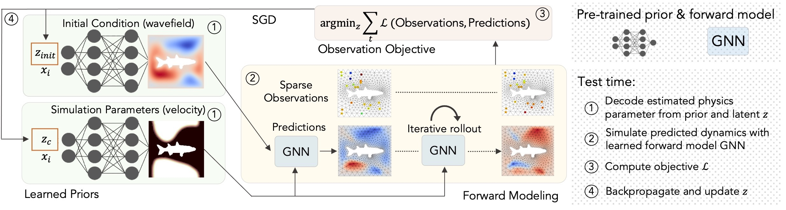

## Learning to Solve PDE-constrained Inverse Problems with Graph Networks | ICML 2022
### [Project Page](https://cyanzhao42.github.io/LearnInverseProblem) | [Video](https://www.youtube.com/watch?v=ov0jxa4xHGU) | [Paper](https://arxiv.org/abs/2206.00711)
Official PyTorch implementation.<br>[Learning to Solve PDE-constrained Inverse Problems with Graph Networks](http://www.computationalimaging.org/publications/graphpde/)<br>
[Qingqing Zhao]()\*,
[David B. Lindell](https://davidlindell.com),
[Gordon Wetzstein](https://computationalimaging.org)<br>
Stanford University <br>

## Quickstart
To setup a conda environment use these commands
```
conda env create -f environment.yml
conda activate gnn
```
Dataset and pretrained model and validation samples can be download from "". Unzip and place model and data in the **data** folder.

Now you can solve invere problem with 2D wave equation with the following commands.
```
# with prior
python InverseProblem/experiment_scripts/run_gnn.py  --config InverseProblem/config/density_gnn_p.ini
python InverseProblem/experiment_scripts/run_gnn.py  --config InverseProblem/config/init_state_gnn_p.ini 
# without prior
python InverseProblem/experiment_scripts/run_gnn.py  --config InverseProblem/config/density_gnn_np.ini 
python InverseProblem/experiment_scripts/run_gnn.py  --config InverseProblem/config/init_state_gnn_np.ini 
```
You may also run the notebooks **notebook/inverse_wave_equation_density.ipynb** and **notebook/inverse_wave_equation_init.ipynb** for a quick demo and visualization.

## Training
We also provide sample training script for both GNN and prior network. Training dataset for both can be downloaded from "" and should be placed in the **data** folder. 
```
# train GNN forward model
python GNN/train_2d_wave_equation.py --file ./data/training  --diffML --normalize --log --lr_schedule
# train generative prior
python Prior/autodecoder.py  --num_pe_fns 3 --use_pe --dataset_size 10000 --batch_size 32 --gpu 1  --regularize --irregular_mesh --jitter --prior init_state
python Prior/autodecoder.py  --num_pe_fns 3 --use_pe --dataset_size 10000 --batch_size 32 --gpu 1  --regularize --irregular_mesh --jitter --prior density
```


## Citation

```
@inproceedings{qzhao2022graphpde,
    title={Learning to Solve PDE-constrained Inverse Problems with Graph Networks},
    author={Qingqing Zhao and David B. Lindell and Gordon Wetzstein}
    journal={ICML},
    year={2022}
}
```
